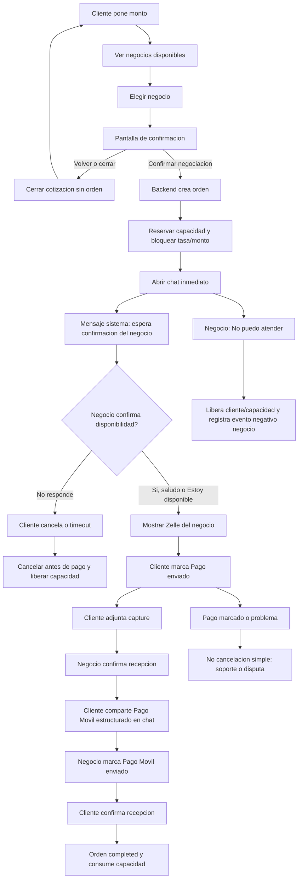

# Slice 50A Owner Flow Reference

Status: OWNER_REFERENCE_ALIGNED - IMPLEMENTED LOCALLY - VALIDATION PENDING

Purpose: this file is the textual source of truth for mapping the current NODO
P2P negotiation flow against the Owner's desired flow. Use it together with
`nodo_flujo_p2p.png`. The image explains intent; this document defines the
behavior the Builder must map against.

## Product Rule

- Before the client confirms, there is only a quote.
- After the client confirms, there is a formal operation.
- Closing a quote is not the same as cancelling a created operation.

## Desired Flow

## Non-Negotiable Rules

1. Before confirmation:
   - no order;
   - no chat;
   - no capacity reservation;
   - no credit consumption.

2. Confirmation creates the formal operation:
   - unique order ID;
   - locked rate;
   - locked amounts;
   - reserved capacity;
   - exclusive chat.

3. Chat opens immediately after confirmation.

4. The first chat message must tell the client not to send payment until the
   authorized payment data is available in the conversation.

5. A first business message only means that the business responded. It does
   not authorize payment.

6. Zelle details are shown only after the business shares its configured Zelle
   in the private order chat by:
   - writing that configured Zelle manually; or
   - using the compact action `Compartir datos de pago`.

7. USDT uses the wallet already configured by the business and frozen in the
   order. The business must share it explicitly with `Compartir wallet` before
   the client can reveal or report payment. It renders with the same compact
   chat bubble and copy action as Zelle.
   Reporting USDT does not require the client to provide a transaction hash.
   The client must confirm the exact network with the business in chat before
   sending funds.

8. The client can cancel only before marking `Pago enviado`.

9. After `Pago enviado`, simple cancellation is not allowed. Problems must go
   to support or dispute.

10. The business must not have a normal cancel button.

11. The business may use `No puedo atender` only before the client marks
   `Pago enviado`. This must:
   - release the client;
   - release capacity;
   - close the operation safely;
   - record a negative operational event for the business.

12. Timeout before payment must:
    - close the operation;
    - release capacity;
    - record the cause;
    - let the client search again.

## Minimal Chat Experience

The negotiation must feel like a chat, not a form.

Preferred sequence:

1. System: `Negociacion creada. Coordinen por aqui. No envies el pago hasta que el negocio comparta sus datos.`
2. Business: any message means only that the business responded.
3. Business shares its configured Zelle with `Compartir datos de pago` or its
   USDT wallet with `Compartir wallet`.
4. Client sends the selected payment method outside NODO.
5. Client optionally attaches proof and taps the method-specific compact action.
6. Client report uses the locked order amount. USDT can be marked sent without
   asking the client for a transaction hash.
7. Business confirms receipt.
8. Client shares the structured Pago Movil receiver details from the chat. The
   UI renders them as a chat bubble, but they are not a free-form message.
9. Business marks Pago Movil sent.
10. Client confirms receipt.

Accounting:

- step 7 consumes the publication credit exactly once;
- step 10 does not consume credit again;
- step 10 consumes the reserved operational capacity exactly once.

## UI Constraints

- Chat first.
- Mobile first.
- Compact actions.
- Small buttons.
- No large cards.
- No long pre-chat forms.
- No controls covering the conversation.
- Keyboard must not hide the chat/composer.
- The user should understand the negotiation state without reading docs.

## Mapping Questions For Builder

The Builder must inspect current code and answer:

1. Where does the current system create the order?
2. What information does the client have to provide before order creation?
3. When is capacity reserved?
4. When is chat allowed?
5. What blocks chat from opening immediately?
6. When are payment instructions shown?
7. Can Zelle be delayed until business availability confirmation?
8. What state represents business availability confirmation today, if any?
9. What current screens create friction or duplicate steps?
10. What endpoints/states must change for Slice 50A?

## Out Of Scope For Mapping

- No runtime changes.
- No migrations.
- No production.
- No real payment-provider changes.
- No Base USDC changes.
- No credit runtime changes; the contract records that credit is consumed at
  official business payment confirmation, not at order completion.
- No public reputation changes without separate Owner approval.
- No support/dispute rewrite.
