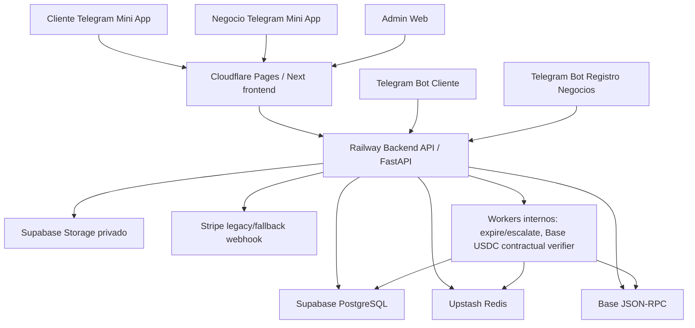

# SYSTEM_MAP

Estado: OFFICIAL
Ultima actualizacion: 2026-07-11

## Componentes y comunicacion

## Sincrono vs asincrono

Sincronos:

- Auth Telegram: frontend -> `POST /api/v1/auth/telegram`.
- Marketplace: frontend -> `GET /api/v1/ads/search`.
- Crear orden: frontend -> `POST /api/v1/orders`.
- Reportar pago/evidencia: frontend -> payment endpoints.
- Admin Web: frontend -> `/api/v1/admin/*`.
- Soporte: frontend -> `/api/v1/support/*` y `/api/v1/admin/support/*`.

Asincronos o controlados:

- Telegram webhooks.
- Stripe webhook legacy/fallback si esta habilitado.
- Job `expire_and_escalate_orders`.
- Watcher `verify_base_usdc_credit_purchases`.
- Staging stress/smoke scripts.

## Flujos operativos reales

### Autenticacion

1. Mini App recibe `initData` de Telegram.
2. Frontend llama `POST /api/v1/auth/telegram`.
3. Backend valida `BOT_TOKEN`, expira initData y emite JWT.
4. Superficies usan JWT para `/users/me`, `/surface/session` o endpoints de producto.

Primer componente a revisar si falla: API readiness, `BOT_TOKEN`, `/auth/telegram`, CORS/API base URL.

### Acceso del negocio

1. Negocio se identifica por Telegram.
2. Mini App Negocio usa `GET /api/v1/surface/session` con `X-NODO-Surface: business_mini_app`.
3. Backend exige user active, role `business_owner`, business approved y `business_access_links.status = active`.

Primer componente a revisar si falla: `surface/session`, user status, business status, access links, Telegram initData.

### Creditos Base USDC contractual

1. Negocio inicia el checkout de creditos desde Mini App Negocio.
2. Backend crea un handoff efimero y prepara la compra contractual.
3. MetaMask confirma la wallet del negocio y solicita autorizacion exacta de USDC.
4. Backend firma una autorizacion limitada para el contrato NODO.
5. MetaMask envia el pago final al contrato.
6. Watcher/verifier consulta Base RPC y valida evento, token, monto, contrato, payer y confirmaciones.
7. Si todo coincide, acredita en `credits_ledger` exact-once.

Primer componente a revisar si falla: `credit_purchases`, `credit_purchase_onchain_payments`, handoff Redis, contrato Base USDC, Base RPC, signer backend y watcher.

### Orden cliente-negocio

1. Cliente busca marketplace.
2. Cliente crea orden.
3. Backend mueve anuncio `active -> in_order`, crea orden, state event y audit.
4. Cliente ve instrucciones y reporta pago.
5. Negocio confirma o reporta un problema mediante disputa; si confirma, luego
   marca entregado segun estado.
6. Chat/disputa/soporte siguen el estado sin cierre unilateral del pago reportado.

Primer componente a revisar si falla: DB, Redis idempotency, ad status, order state events.

### Bot de registro de negocios

1. Telegram envia update a `/api/v1/business-intake/telegram/webhook/{secret}`.
2. Backend valida secret derivado de `BUSINESS_INTAKE_BOT_TOKEN`.
3. Conversacion guarda draft parcial y documentos privados.
4. Admin revisa intake y decide.
5. Bot no crea negocio activo ni access link.

Primer componente a revisar si falla: webhook secret, token, intake row, last_step, storage.

### Admin y soporte

1. Admin Web autentica contra backend.
2. Admin/super_admin/support acceden segun RBAC.
3. Staff granular puede operar soporte solo si tiene perfil/permisos activos.
4. Acciones mutantes requieren reason, idempotency y audit.

Primer componente a revisar si falla: JWT, user role/status, staff profile, permission matrix, audit logs.

## Componentes que pueden detener toda la operacion

- Supabase PostgreSQL.
- Railway API.
- JWT/auth secrets mal configurados.
- Upstash Redis para mutaciones/idempotencia/locks.
- Admin Web/API si se requiere control de incidentes.

## Componentes degradables

- Marketplace cache Redis: puede degradar latencia, pero DB puede responder si no esta saturada.
- Telegram intake bot: no detiene ordenes activas, pero detiene captacion.
- Stripe legacy: Base USDC es flujo principal actual para creditos.
- Support attachments: tickets pueden continuar sin adjuntos si storage falla parcialmente.
